---
## Front matter
lang: ru-RU
title: Лабораторная работа №1
subtitle: Математическое моделирование
author:
  - Волгин И.А.
institute:
  - Российский университет дружбы народов, Москва, Россия
date: 22 февраля 2025

## i18n babel
babel-lang: russian
babel-otherlangs: english

## Formatting pdf
toc: false
toc-title: Содержание
slide_level: 2
aspectratio: 169
section-titles: true
theme: metropolis
header-includes:
 - \metroset{progressbar=frametitle,sectionpage=progressbar,numbering=fraction}
---

# Информация

## Докладчик

:::::::::::::: {.columns align=center}
::: {.column width="95%"}

  * Волгин Иван Алексеевич
  * Студент группы НФИбд-01-22 
  * Российский университет дружбы народов

:::
::::::::::::::

# Выполнение лабораторной работы

## Создание директории и файл

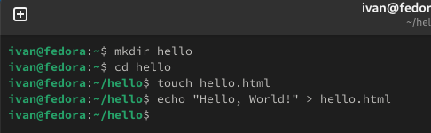{#fig:001 width=95%}

## Инициализация репозитория и добавление файла

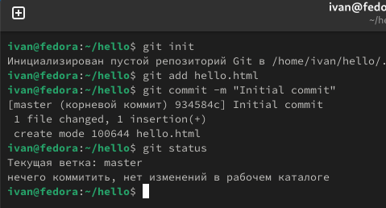{#fig:002 width=95%}

## Изменения в файле, cообщение коммита, проверка статуса и коммит

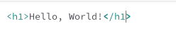{#fig:003 width=30%}
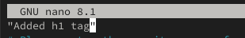{#fig:004 width=30%}
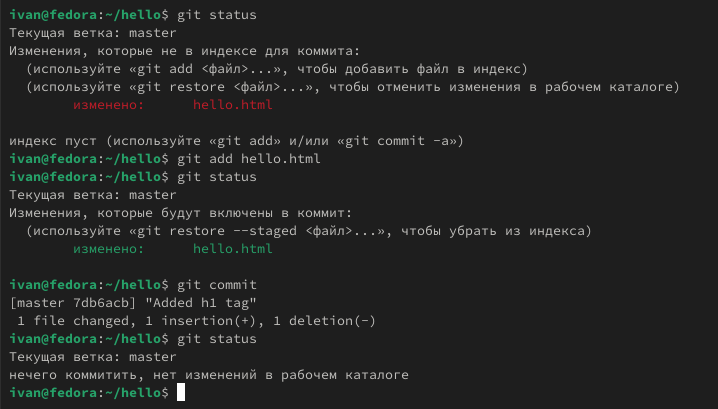{#fig:005 width=30%}

## Изменения в файле и выполнение задачи в терминале

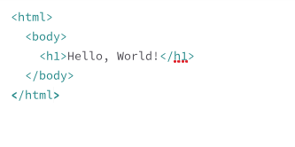{#fig:006 width=30%}
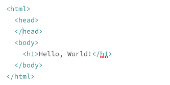{#fig:007 width=30%}
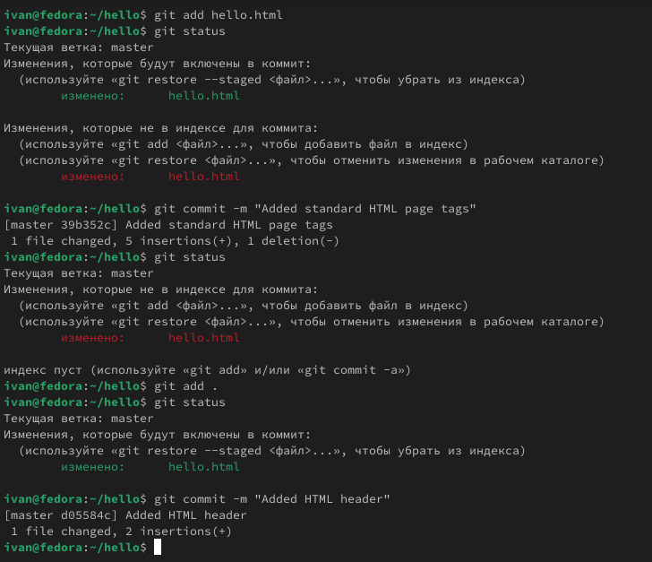{#fig:008 width=30%}

## История и первый коммит 

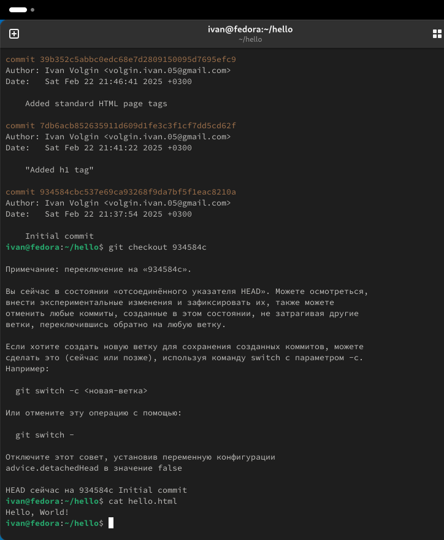{#fig:010 width=95%}

## Переключение обратно на последний коммит

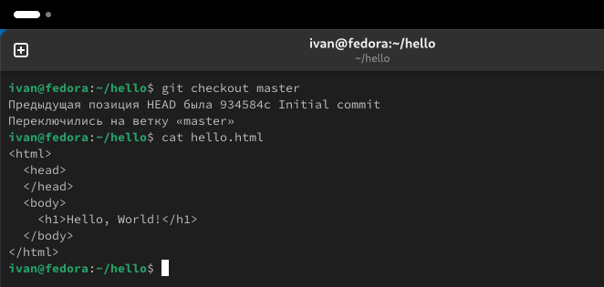{#fig:011 width=95%}

## Создание тегов версий

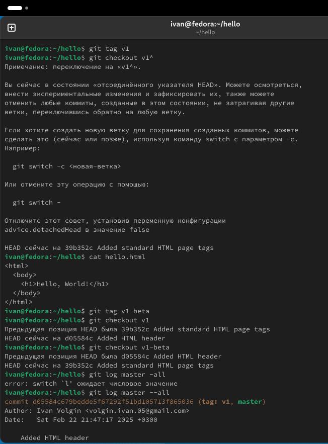{#fig:012 width=95%}

## Отмена локальных изменений до индексации

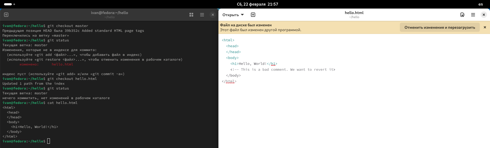{#fig:013 width=95%}

## Отмена локальных изменений перед коммитом

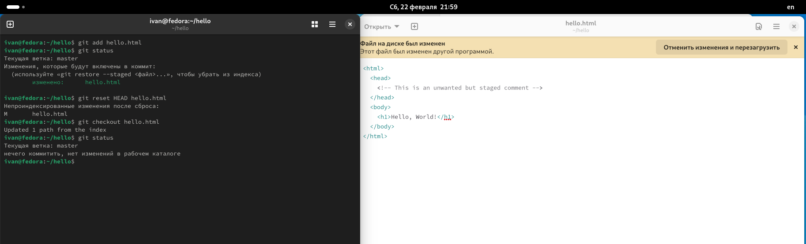{#fig:014 width=95%}

## Отмена коммитов

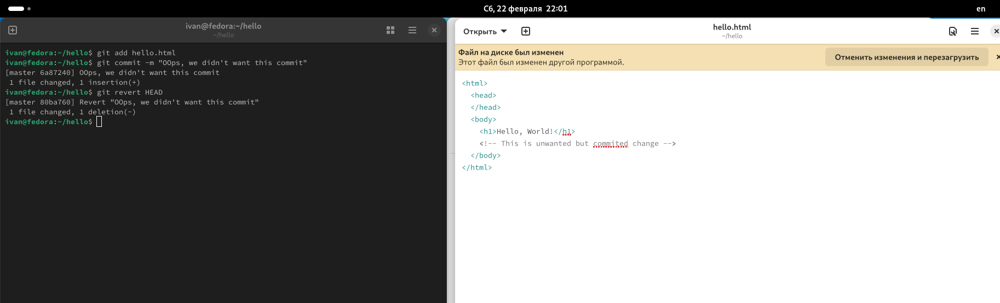{#fig:015 width=95%}

## Удаление коммитов из ветки

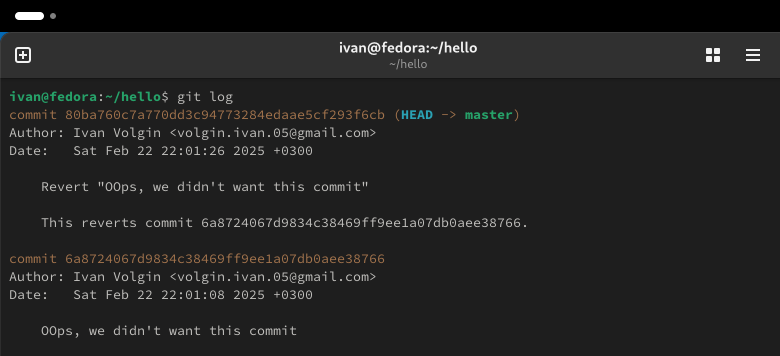{#fig:016 width=30%}
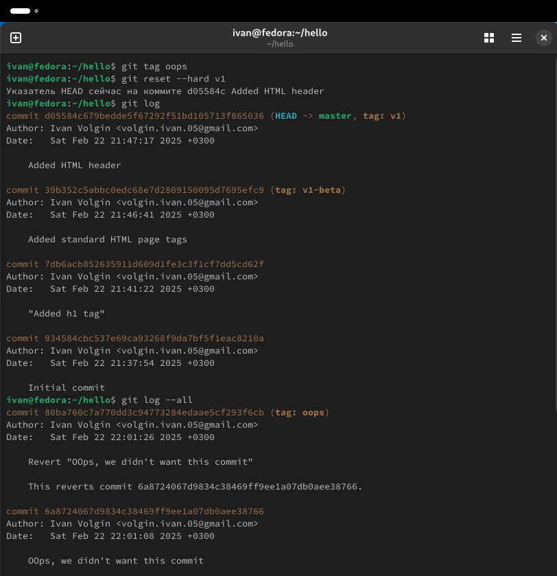{#fig:017 width=30%}
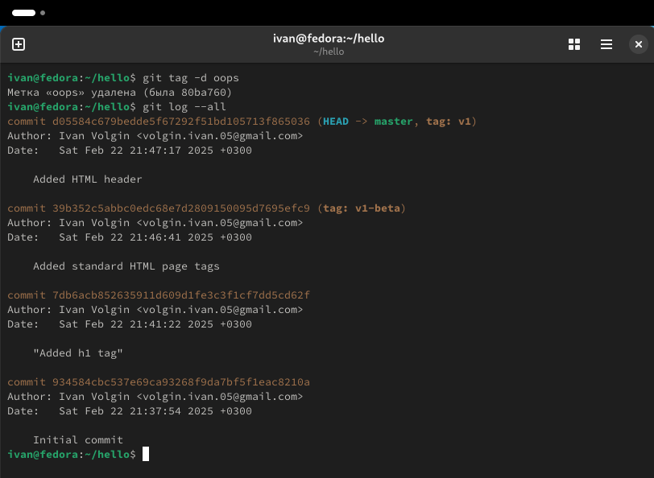{#fig:018 width=30%}

## Внесение изменений в коммиты

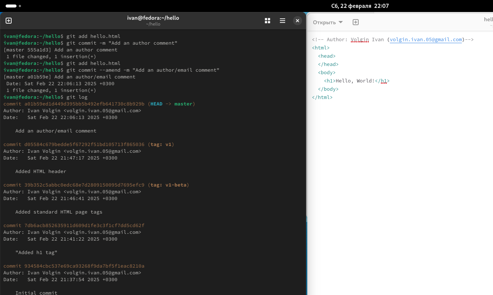{#fig:019 width=95%}

## Перемещение файлов

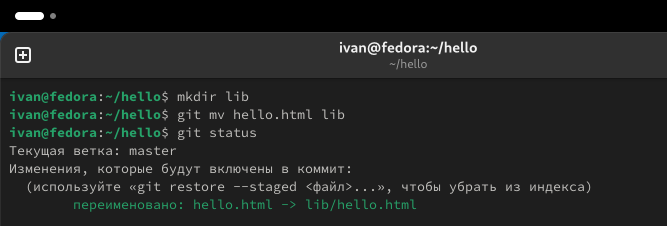{#fig:020 width=95%}

## Добавление index.html

## Выводы

В ходе выполнения лабораторной работы я повторил базовые действия с git и научился новым.

