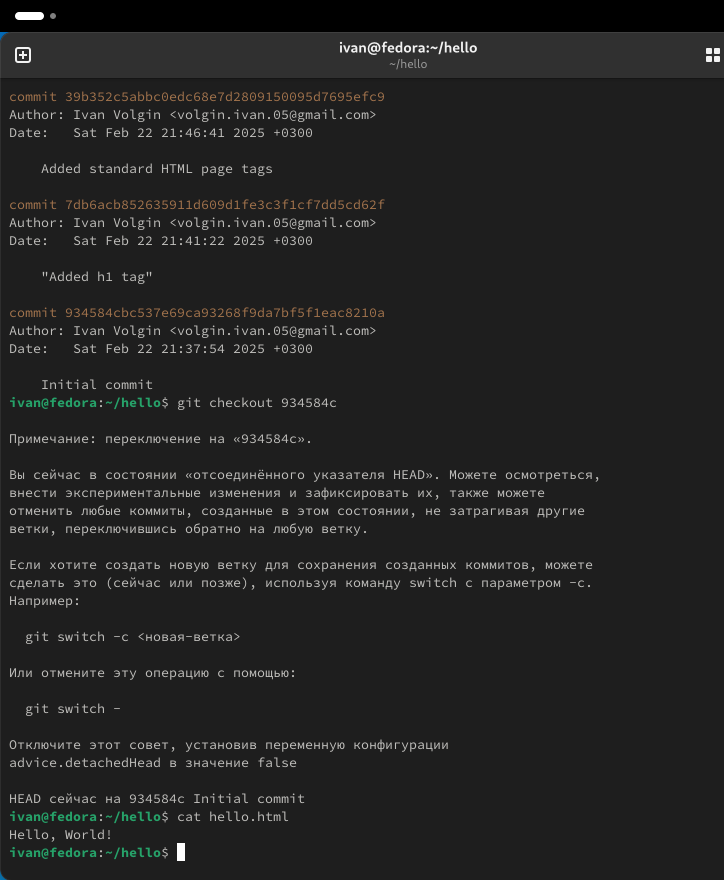

---
## Front matter
title: "Лабораторная работа №1"
subtitle: "Математическое моделирование"
author: "Волгин Иван"

## Generic otions
lang: ru-RU
toc-title: "Содержание"

## Bibliography
bibliography: bib/cite.bib
csl: pandoc/csl/gost-r-7-0-5-2008-numeric.csl

## Pdf output format
toc: true # Table of contents
toc-depth: 2
lof: true # List of figures
lot: false # List of tables
fontsize: 12pt
linestretch: 1.5
papersize: a4
documentclass: scrreprt
## I18n polyglossia
polyglossia-lang:
  name: russian
  options:
	- spelling=modern
	- babelshorthands=true
polyglossia-otherlangs:
  name: english
## I18n babel
babel-lang: russian
babel-otherlangs: english
## Fonts
mainfont: IBM Plex Serif
romanfont: IBM Plex Serif
sansfont: IBM Plex Sans
monofont: IBM Plex Mono
mathfont: STIX Two Math
mainfontoptions: Ligatures=Common,Ligatures=TeX,Scale=0.94
romanfontoptions: Ligatures=Common,Ligatures=TeX,Scale=0.94
sansfontoptions: Ligatures=Common,Ligatures=TeX,Scale=MatchLowercase,Scale=0.94
monofontoptions: Scale=MatchLowercase,Scale=0.94,FakeStretch=0.9
mathfontoptions:
## Biblatex
biblatex: true
biblio-style: "gost-numeric"
biblatexoptions:
  - parentracker=true
  - backend=biber
  - hyperref=auto
  - language=auto
  - autolang=other*
  - citestyle=gost-numeric
## Pandoc-crossref LaTeX customization
figureTitle: "Рис."
tableTitle: "Таблица"
listingTitle: "Листинг"
lofTitle: "Список иллюстраций"
lotTitle: "Список таблиц"
lolTitle: "Листинги"
## Misc options
indent: true
header-includes:
  - \usepackage{indentfirst}
  - \usepackage{float} # keep figures where there are in the text
  - \floatplacement{figure}{H} # keep figures where there are in the text
---

# Цель работы

Повторить базовые операции с git  и освоить новые

# Задание

1. Создание проекта.
2. Внесение изменений
3. Индексация изменений
4. Отмена локальных изменений
5. Отмена проиндексированных изменений
6. Отмена коммитов
7. Удаление тега
8. Внесение изменени в коммиты
9. перемещение файлов

# Выполнение лабораторной работы

Для начала работы c git нужно было задать его конфигурацию, но у меня это уже было сделано, так как на этой же виртуальной машине я выполняю курс имитационного моделирования. Так что я сразу начал с выполнения первого задания.

1. Для начала нужно было создать директорию hello, в нем файл hello.html и написать в него текст (рис. [-@fig:001]).

{#fig:001 width=70%}

Дальше я инициализировал репозиторий, добавил в него файл и сделал коммит. Затем я проверил его статус (рис. [-@fig:002]).

{#fig:002 width=70%}

После этого я внес изменения в файл (рис. [-@fig:003]) и проверил состояние каталога, затем сделал коммит без сообщения и снова проверил состояние каталога (рис. [-@fig:005]). При коммите без сообщения меня перекинуло в редактор, где я его и написал (рис. [-@fig:004]).

{#fig:003 width=70%}

{#fig:004 width=70%}

{#fig:005 width=70%}

Затем я снова открыл файл и внес в него изменения (рис. [-@fig:006]), добавил это изменение в гит (рис. [-@fig:008]), после этого снова поменял файл (рис. [-@fig:007]). После этого мне нужно было сделать коммит проиндексированного изменения, проверить статус, доавить сторое изменение и проверить его статус, а затем сделать еще один коммит (рис. [-@fig:008])

{#fig:006 width=70%}

{#fig:007 width=70%}

{#fig:008 width=70%}

Переходим к следующему заданию и здесь нужно было работать со старыми версиями. Сначала я вывел историю, и также вывел ее чуть более красиво. Затем я переключился на первый коммит (рис. [-@fig:009]).

{#fig:009 width=70%}

После этого я переключился обратно на последний коммит (рис. [-@fig:010]).

{#fig:010 width=70%}

# Выводы

В ходе выполнения лабораторной работы я повторил базовые действия с git и научился новым.
