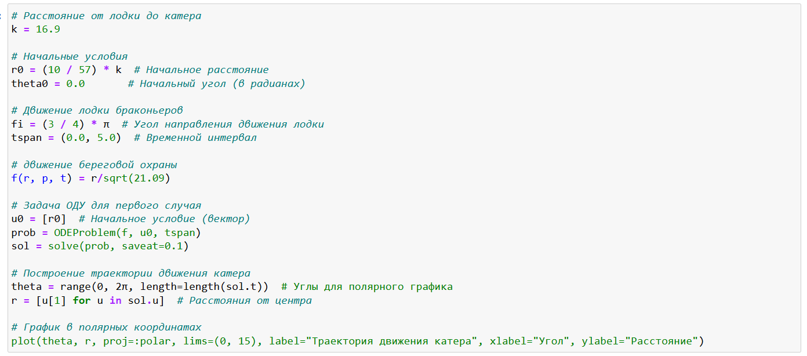
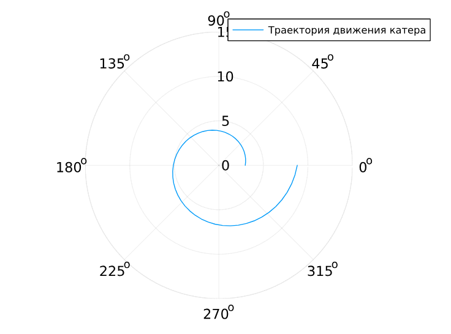
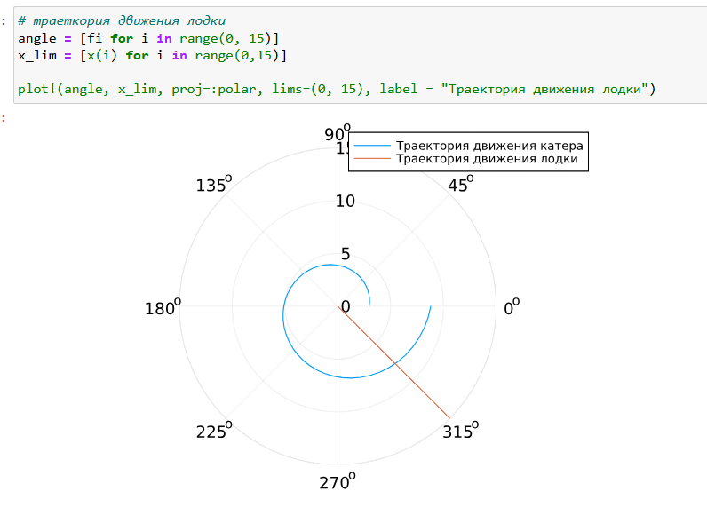
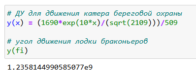
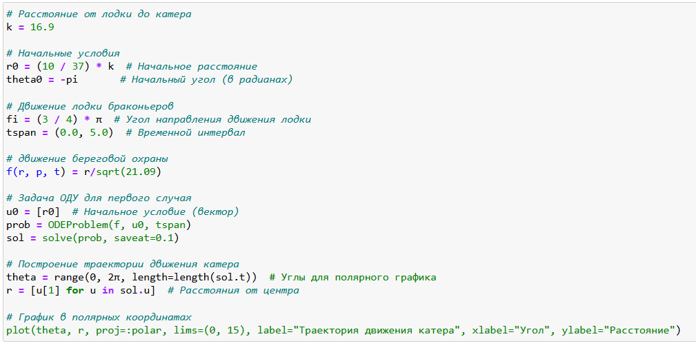
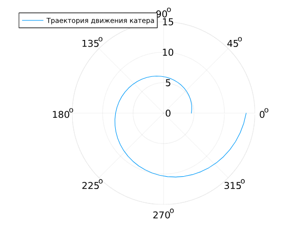
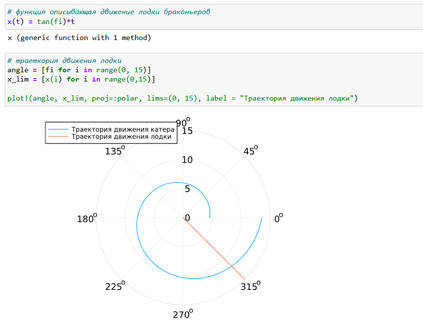
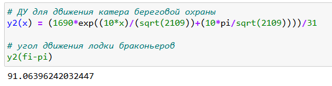

---
## Front matter
lang: ru-RU
title: Лабораторная работа №2
subtitle: Математическое моделирование
author:
  - Волгин И.А.
institute:
  - Российский университет дружбы народов, Москва, Россия
date: 08 марта 2025

## i18n babel
babel-lang: russian
babel-otherlangs: english

## Formatting pdf
toc: false
toc-title: Содержание
slide_level: 2
aspectratio: 169
section-titles: true
theme: metropolis
header-includes:
 - \metroset{progressbar=frametitle,sectionpage=progressbar,numbering=fraction}
---

# Информация

## Докладчик

:::::::::::::: {.columns align=center}
::: {.column width="95%"}

  * Волгин Иван Алексеевич
  * Студент группы НФИбд-01-22
  * Российский университет дружбы народов

:::
::::::::::::::

# Выполнение работы

## Цель работы

Построить математическую модель для выбора правильной стратегии при решении задачи о погоне

# Построение модели

{#fig:001 width=70%}

## Траектория катер

{#fig:002 width=70%}

## Cовместные траектории

{#fig:003 width=70%}

## Tочка пересечения

{#fig:004 width=70%}

## Код для построения модели второго случая

{#fig:005 width=70%}

## Траектория катера

{#fig:006 width=70%}

## Cовместные траектории второго случая

{#fig:007width=70%}

## Tочка пересечения

{#fig:008 width=70%}

## Выводы

В процессе выполнения данной лабораторной работы я построил математическую модель для выбора правильной стратегии при решении задачи о погоне.
